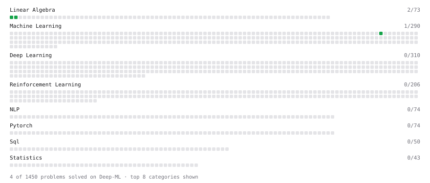

# Deep-ML

My machine learning practice from [Deep-ML](https://www.deep-ml.com). Every solution here was written by hand.

**7** solved · 6 problems · 0 labs · 1 math

[**Browse the interactive portfolio**](https://RizFie.github.io/deep-ml/) to replay this filling in over time.

## Problems

| | Difficulty | Solved | |
| --- | --- | --- | --- |
| [Derivative of a Polynomial](https://www.deep-ml.com/problems/116) | easy | 2026-07-15 | [solution](problems/0116-derivative-of-a-polynomial) |
| [Gradient Direction and Magnitude](https://www.deep-ml.com/problems/308) | easy | 2026-07-15 | [solution](problems/0308-gradient-direction-and-magnitude) |
| [Matrix-Vector Dot Product](https://www.deep-ml.com/problems/1) | easy | 2026-06-30 | [solution](problems/0001-matrix-vector-dot-product) |
| [Transpose of a Matrix](https://www.deep-ml.com/problems/2) | easy | 2026-07-14 | [solution](problems/0002-transpose-of-a-matrix) |
| [Product Rule for Derivatives](https://www.deep-ml.com/problems/309) | medium | 2026-07-16 | [solution](problems/0309-product-rule-for-derivatives) |
| [Quotient Rule for Derivatives](https://www.deep-ml.com/problems/312) | medium | 2026-07-16 | [solution](problems/0312-quotient-rule-for-derivatives) |

## Math

| | Difficulty | Solved | |
| --- | --- | --- | --- |
| [Derivatives and Gradients](https://www.deep-ml.com/math-problems/1) | easy | 2026-09-26 | [solution](math/0001-derivatives-and-gradients) |

---

_This file is regenerated by Deep-ML on every push._
